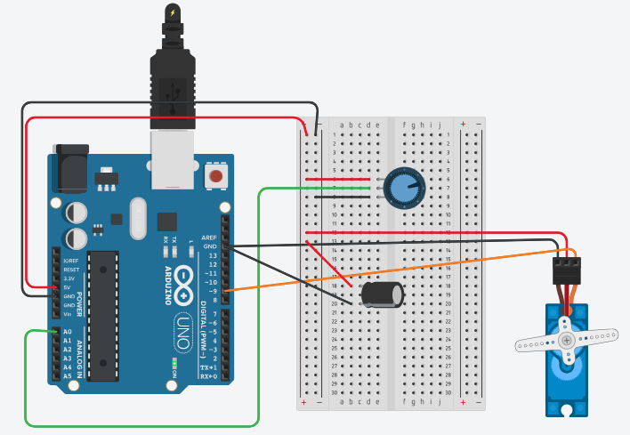

# Servo controlled by a potentiometer

Turning a potentiometer sets the angle of a servo motor (0–180°).
Simulated in Tinkercad; also built on the real Elegoo kit (without the capacitor).

## Components
- Arduino Uno
- Potentiometer, 10 kΩ
- SG90 micro servo
- Electrolytic capacitor, 100 µF, 16 V

## Wiring
- Potentiometer: middle pin (wiper) to A0, outer pins to 5V and GND
- Servo: red to 5V, brown to its own Arduino GND pin, orange (signal) to pin 9
- Capacitor: + to 5V next to the servo, − to the servo's GND

## How it works
- `analogRead` uses the 10-bit ADC: 0–5 V becomes a number from 0 to 1023 (~4.9 mV per step)
- `map` rescales 0–1023 linearly to an angle of 0–180°
- The Servo library sends a pulse every 20 ms (50 Hz); the pulse width
  (~0.5 ms to ~2.4 ms) tells the servo which angle to hold
- When the motor starts moving, its current jumps to hundreds of mA in a fraction
  of a millisecond. The supply's resistance and inductance make the 5V line dip
  (ΔV = I·R + L·dI/dt). The capacitor is a local charge reservoir that delivers
  those spikes, keeping the voltage stable.
- The servo has its own GND wire so its current spikes don't shift the
  potentiometer's ground reference, which would cause jitter.

## What I learned
- How a servo is controlled by pulse width, not by voltage level
- Why motors need decoupling capacitors, and how to size one (ΔV = I·Δt / C)
- How shared ground paths can couple noise between parts of a circuit
